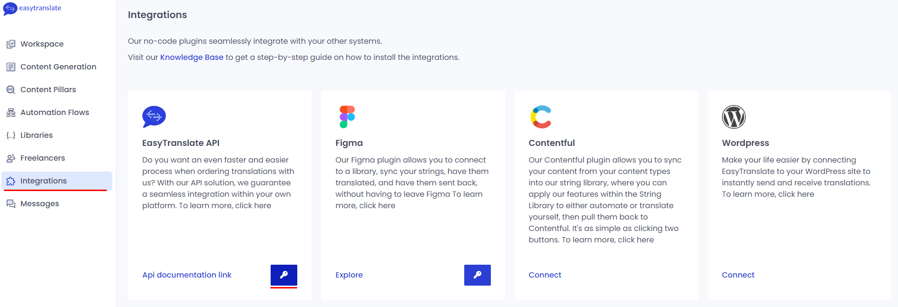
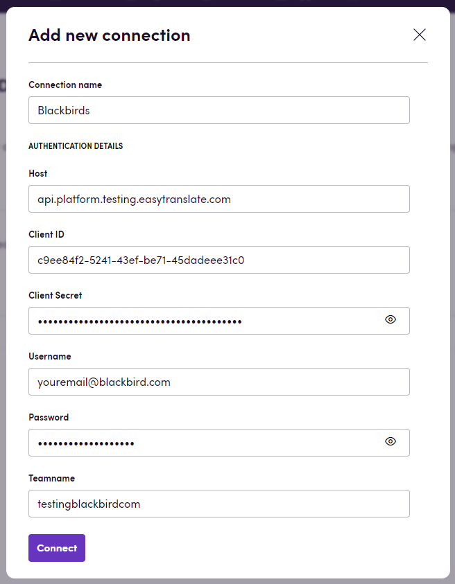

# Blackbird.io EasyTranslate

Blackbird is the new automation backbone for the language technology industry. Blackbird provides enterprise-scale automation and orchestration with a simple no-code/low-code platform. Blackbird enables ambitious organizations to identify, vet and automate as many processes as possible. Not just localization workflows, but any business and IT process. This repository represents an application that is deployable on Blackbird and usable inside the workflow editor.

## Introduction

<!-- begin docs -->

EasyTranslate is a SaaS company offering translation management, cutting-edge generative AI and freelance translator/copy editor access - all on one software.

Whether you’re looking to create content from scratch, translate your website, webshop, CMS or more - we have all the tools you need to succeed. Integrate with our many no-code plugins and automate your entire translation and content generation processes.

## Before setting up

Before you can connect, please ensure that you have completed the following steps:

1. Create an account on the EasyTranslate system
2. Set up an integration with the **EasyTranslate API** to obtain your Client ID and Client Secret

To obtain your Client ID and Client Secret, navigate to the 'Integrations' page and locate the **EasyTranslate API** section

3. Know your teamname. By default, you can find it by clicking on the bottom left corner and it will be located under your email

## Connecting

To connect to EasyTranslate, follow these steps:

1. Navigate to the "Apps" section and search for "EasyTranslate".
2. Click on "Add Connection".
3. Name your connection for future reference, e.g., "EasyTranslate".
4. Fill in the "Host" field with your host. It should look like: api.platform.sandbox.easytranslate.com.
5. Fill in the "Client ID" field.
6. Fill in the "Client Secret" field.
7. Fill in the "Username" field with the username or email of the user who will perform the actions.
8. Fill in the "Password" field with the password of the user who will perform the actions.
9. Fill in the "Teamname" field (should be underscored). Note that the teamname field will not be validated, so make sure to provide the correct one to avoid future errors.
10. Click on "Connect".

## Actions

### Library

- **Get all libraries**: Get all libraries for a team
- **Get library**: Get a library for a team
- **Create library**: Create a library for a team
- **Delete library**: Delete a library for a team
- **Start library automation**: Start library automation for a team
- **Add target languages to library**: Add target languages to a library for a team
- **Remove target languages from library**: Remove target languages from a library for a team
- **Download library**: Download a library for a team

### Project

- **Get all projects**: Get all projects for a team
- **Create a project**: Create a project from form
- **Create project with file**: Create a project from the uploaded file
- **Get project**: Get a project by ID
- **Download source file**: Download source file from a project

### Task

- **Get all tasks**: Get all tasks for a specified project
- **Get task by ID**: Get task from project by ID

### Translation key

- **Get translation keys**: Get translation keys for specified library
- **Get translation key**: Get translation key for specified library
- **Create translation keys**: Create translation keys for specified library
- **Create translation key**: Create translation key for specified library
- **Delete translation key**: Delete translation key for specified library

### Translation string

- **Get translation strings**: Get all translation strings for a specific library. This action retrieves all the translation strings associated with a particular library. It can be useful for retrieving all the available translations for a given library.
- **Get translation string**: Get a specific translation string for a library. This action retrieves a single translation string based on the provided library ID and translation string ID. It can be used to fetch a specific translation string for further processing or modification.
- **Update translation string**: Update a translation string for a specific library. This action allows you to update the text of a translation string in a library. It requires the library ID, translation string ID, and the updated text as input.
- **Update translation strings**: Update multiple translation strings for a specific library. This action enables you to update multiple translation strings in a library at once. It requires the library ID, a list of translation string IDs, and the corresponding updated texts as input.

### Folder

- **Get all folders**: Get all folders for a team
- **Get folder**: Get a folder for a team
- **Create folder**: Create a folder for a team
- **Update folder**: Update a folder for a team

### Content

- **Download content**: Download source or target content based on provided URL

### Content generation

- **Create content**: Create content based on provided prompt and settings

## Events

- **On task updated**: Triggered when a task is updated
- **On project price accepted**: Triggered when a project price is accepted
- **On string key updated**: Triggered when a string key is updated
- **On project approval needed**: Triggered when a project approval is needed
- **On project price declined**: Triggered when a project price is declined
- **On project cancelled**: Triggered when a project is cancelled by the customer

## Feedback

Do you want to use this app or do you have feedback on our implementation? Reach out to us using the [established channels](https://www.blackbird.io/) or create an issue.

<!-- end docs -->
